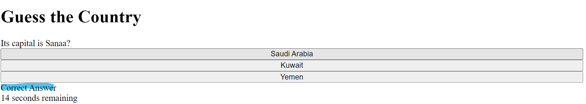
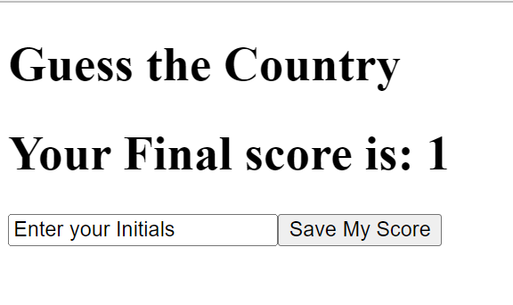
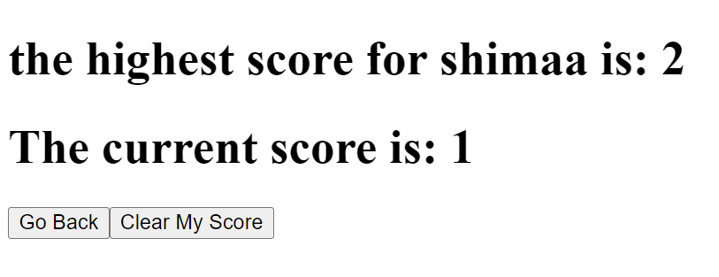

# flagQuiz
this quiz is to guess the country based on the capital of the country.

# the deployed url
https://shaimaaghamry.github.io/flagQuiz/

# 1. when the user open the url , the user should start the quiz by clicking on the start quiz button

# 2. when the quiz is started, the first question will be displayed and a decremental time will be displayed as well

# 3. when the user select an answer, the status will be displayed to inform the user if the answer is correct or wrong

# 4. The quiz will be ended if the questions are all answered or the timer ended , then the user could save his score 

# 5. After the user save his score, then the highest score will be displayed.

# 6. The user has an option to go back and start new quiz or to clear his score from the local storage

